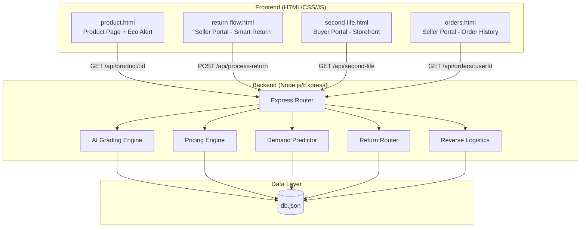
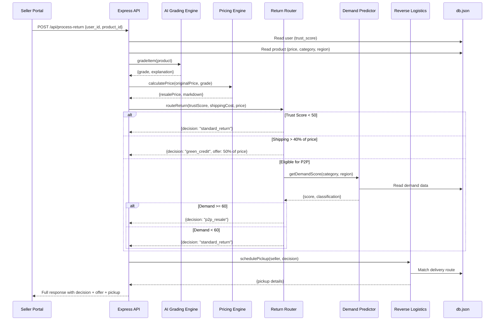

# Design Document: Second Life Commerce

## Overview

Second Life Commerce is a full-stack localhost prototype demonstrating an AI-powered returns and sustainable resale pipeline. The system integrates AI damage detection, dynamic pricing, predictive demand routing, instant buy-back refunds, and reverse logistics into a seamless experience for sellers (mobile-view) and buyers (desktop-view).

The architecture follows a monolithic Node.js/Express server with a file-based JSON data store, serving static HTML/CSS/JS pages that communicate via REST APIs. The AI grading is simulated with deterministic logic (analyzing file metadata and mock patterns) rather than actual ML inference, appropriate for a hackathon prototype.

### Key Design Decisions

1. **Monolithic Express server** — Single server handles API routes, static file serving, and data persistence. Simplifies deployment and demo for hackathon context.
2. **File-based JSON persistence** — `/data/db.json` acts as the database, read/written synchronously during requests. No external DB dependency.
3. **Simulated AI grading** — Uses file size, count, and randomized logic to assign grades deterministically for demo reproducibility.
4. **Separation of portals** — Seller Portal (mobile-optimized, max 480px) and Buyer Portal (desktop-optimized, min 1024px) are separate HTML pages with shared CSS variables for the Amazon color scheme.
5. **Stateless routing logic** — The Return Router evaluates conditions in strict priority order using pure functions with no side effects beyond the final state mutation.

## Architecture



### Request Flow: Process Return



## Components and Interfaces

### Backend Modules

#### 1. AI Grading Engine (`/src/services/gradingEngine.js`)

**Purpose:** Simulates AI-based condition assessment of returned items.

**Interface:**
```javascript
/**
 * Grades an item based on uploaded media metadata.
 * @param {Object} params
 * @param {number} params.imageCount - Number of images uploaded (1-10)
 * @param {number} params.totalFileSize - Total size of uploaded files in bytes
 * @param {string} params.fileType - "image" or "video"
 * @returns {{grade: "A"|"B"|"C", explanation: string}}
 */
function gradeItem({ imageCount, totalFileSize, fileType })
```

**Grading Logic (simulated):**
- Uses a deterministic hash of product_id + file metadata to assign grade
- Grade A: hash % 3 === 0
- Grade B: hash % 3 === 1
- Grade C: hash % 3 === 2

#### 2. Pricing Engine (`/src/services/pricingEngine.js`)

**Purpose:** Calculates resale prices based on condition grades.

**Interface:**
```javascript
/**
 * Calculates the resale price for a graded item.
 * @param {number} originalPrice - Original price in INR (positive integer)
 * @param {"A"|"B"|"C"} grade - AI-assigned condition grade
 * @returns {{resalePrice: number, markdownPercent: number, markdownAmount: number}}
 * @throws {Error} If originalPrice <= 0 or grade is unrecognized
 */
function calculateResalePrice(originalPrice, grade)
```

**Pricing Rules:**
- Grade A: 15% markdown → resalePrice = round(originalPrice * 0.85)
- Grade B: 30% markdown → resalePrice = round(originalPrice * 0.70)
- Grade C: 50% markdown → resalePrice = round(originalPrice * 0.50)
- Rounding: Math.round() (standard: 0.5 rounds up)

#### 3. Demand Predictor (`/src/services/demandPredictor.js`)

**Purpose:** Retrieves and classifies demand for a product category in a region.

**Interface:**
```javascript
/**
 * Gets demand score and classification for a category+region pair.
 * @param {string} category - Product category
 * @param {string} region - Seller's region
 * @param {Array} demandData - Regional demand records from db.json
 * @returns {{demandScore: number, classification: "high"|"low"}}
 */
function getDemandScore(category, region, demandData)
```

**Rules:**
- Score >= 60 → "high"
- Score < 60 → "low"
- No matching entry → defaults to score 0, classification "low"

#### 4. Return Router (`/src/services/returnRouter.js`)

**Purpose:** Determines the optimal return path based on trust score, cost analysis, and demand.

**Interface:**
```javascript
/**
 * Routes a return based on priority rules.
 * @param {Object} params
 * @param {number} params.trustScore - Seller's trust score (0-100)
 * @param {number} params.returnShippingCost - Shipping cost in INR
 * @param {number} params.productPrice - Original product price in INR
 * @param {string} params.demandClassification - "high" or "low"
 * @returns {{decision: string, rule: string, trustScore: number, shippingRatio: number, offerAmount: number|null}}
 */
function routeReturn({ trustScore, returnShippingCost, productPrice, demandClassification })
```

**Priority Rules (strict order):**
1. If `trustScore < 50` → `"standard_return"` (short-circuit)
2. If `returnShippingCost / productPrice > 0.40` → `"green_credit"` with offer = `Math.round(productPrice * 0.50)`
3. If `demandClassification === "high"` → `"p2p_resale"`
4. Else → `"standard_return"` (warehouse liquidation)

#### 5. Reverse Logistics (`/src/services/reverseLogistics.js`)

**Purpose:** Matches sellers to delivery routes for item collection.

**Interface:**
```javascript
/**
 * Schedules pickup by matching seller's area to an available route.
 * @param {string} sellerArea - Seller's neighborhood area
 * @param {Array} deliveryRoutes - Available routes from db.json
 * @returns {{scheduled: boolean, pickupDay: string, timeWindow: string, driverName: string} | {scheduled: false, message: string}}
 */
function schedulePickup(sellerArea, deliveryRoutes)
```

#### 6. Data Access Layer (`/src/services/dataStore.js`)

**Purpose:** Provides read/write access to the JSON data store.

**Interface:**
```javascript
function readDB()                    // Returns parsed db.json
function writeDB(data)              // Writes updated data to db.json
function getUserById(userId)        // Returns user record or null
function getProductById(productId)  // Returns product record or null
function getSecondLifeItems()       // Returns all items with inventory_owner = "amazon"
function getOrdersByUserId(userId)  // Returns user's orders from last 30 days
function updateUserCredits(userId, amount)  // Adds amount to user's Green_Credits
function markItemAsAmazonOwned(productId)   // Sets inventory_owner to "amazon"
```

### Frontend Pages

| Page | File | View | Purpose |
|------|------|------|---------|
| Product Page | `public/product.html` | Desktop | Product detail with Eco Alert |
| Order History | `public/orders.html` | Mobile (480px) | Seller's order list with Smart Return buttons |
| Return Flow | `public/return-flow.html` | Mobile (480px) | Upload → Grade → Offer flow |
| Second Life Store | `public/second-life.html` | Desktop (1024px+) | Refurbished marketplace grid |

### API Routes (`/src/routes/api.js`)

| Method | Path | Request | Response |
|--------|------|---------|----------|
| GET | `/api/product/:id` | — | Product JSON (200) or error (404) |
| POST | `/api/process-return` | `{user_id, product_id}` | Routing decision JSON (200) or error (400) |
| GET | `/api/second-life` | — | Array of refurbished items (200) |
| GET | `/api/orders/:userId` | — | Array of user orders (200) |

## Data Models

### db.json Structure

```json
{
  "users": [
    {
      "id": "user_001",
      "name": "Priya Sharma",
      "trust_score": 85,
      "green_credits": 500,
      "region": "Mumbai",
      "area": "Andheri West"
    }
  ],
  "products": [
    {
      "id": "prod_001",
      "name": "Cotton Kurta Set - Women's M",
      "price": 1299,
      "return_shipping_cost": 150,
      "high_return_risk": true,
      "category": "clothing",
      "return_rate": 34,
      "sizing_advice": "This brand runs small. Consider sizing up.",
      "carbon_savings_kg": 2.3,
      "inventory_owner": "seller",
      "graded": false,
      "grade": null,
      "resale_price": null
    }
  ],
  "demand": [
    {
      "category": "clothing",
      "region": "Mumbai",
      "demand_score": 72
    }
  ],
  "delivery_routes": [
    {
      "driver_id": "drv_001",
      "driver_name": "Rajesh Kumar",
      "area": "Andheri West",
      "time_windows": [
        {"day": "Tomorrow", "slot": "2-4 PM"},
        {"day": "Wednesday", "slot": "10-12 AM"}
      ]
    }
  ],
  "orders": [
    {
      "order_id": "ord_001",
      "user_id": "user_001",
      "product_id": "prod_001",
      "order_date": "2025-07-01",
      "status": "delivered",
      "returned": false
    }
  ]
}
```

### TypeScript-Style Type Definitions (for documentation)

```typescript
interface User {
  id: string;
  name: string;
  trust_score: number;      // 0-100
  green_credits: number;    // 0-5000 INR
  region: string;
  area: string;
}

interface Product {
  id: string;
  name: string;             // max 100 chars
  price: number;            // 199-49999 INR
  return_shipping_cost: number;  // 50-500 INR
  high_return_risk: boolean;
  category: "clothing" | "electronics" | "accessories";
  return_rate: number;      // 0-100
  sizing_advice: string | null;
  carbon_savings_kg: number;
  inventory_owner: "seller" | "amazon";
  graded: boolean;
  grade: "A" | "B" | "C" | null;
  resale_price: number | null;
}

interface DemandRecord {
  category: string;
  region: string;
  demand_score: number;     // 0-100
}

interface DeliveryRoute {
  driver_id: string;
  driver_name: string;
  area: string;
  time_windows: Array<{day: string; slot: string}>;
}

interface Order {
  order_id: string;
  user_id: string;
  product_id: string;
  order_date: string;       // ISO date
  status: "delivered" | "processing";
  returned: boolean;
}

interface ProcessReturnRequest {
  user_id: string;
  product_id: string;
}

interface ProcessReturnResponse {
  decision: "standard_return" | "green_credit" | "p2p_resale";
  grade: "A" | "B" | "C";
  offer_amount: number | null;
  demand_score: number;
  demand_classification: "high" | "low";
  reasoning: string;
  resale_price: number;
  markdown_percent: number;
  pickup?: {
    scheduled: boolean;
    pickup_day: string;
    time_window: string;
    driver_name: string;
  };
}
```

## Correctness Properties

*A property is a characteristic or behavior that should hold true across all valid executions of a system — essentially, a formal statement about what the system should do. Properties serve as the bridge between human-readable specifications and machine-verifiable correctness guarantees.*

### Property 1: Grading Output Invariant

*For any* valid upload parameters (1-10 images of JPEG/PNG each ≤10MB, or 1 video MP4 ≤50MB), the `gradeItem` function SHALL return exactly one grade from the set {A, B, C} and an explanation string of at most 200 characters.

**Validates: Requirements 1.3, 1.4**

### Property 2: Upload Validation Rejects Invalid Formats

*For any* file format string not in the set {"jpeg", "png", "mp4"}, the upload validator SHALL reject the request with an error indicating supported formats.

**Validates: Requirements 1.5**

### Property 3: Pricing Calculation Correctness

*For any* original price P (positive integer) and valid grade G ∈ {A, B, C}, the `calculateResalePrice` function SHALL return a resale price equal to `Math.round(P × (1 - markdownRate(G)))` where markdownRate(A) = 0.15, markdownRate(B) = 0.30, markdownRate(C) = 0.50, along with the correct markdownPercent and markdownAmount values.

**Validates: Requirements 2.1, 2.2, 2.3, 2.4, 2.5**

### Property 4: Pricing Rejects Invalid Inputs

*For any* price value ≤ 0 or null/undefined, OR any grade string not in {A, B, C}, the `calculateResalePrice` function SHALL throw an error without returning a result.

**Validates: Requirements 2.6, 2.7**

### Property 5: Demand Classification Threshold

*For any* integer demand score S in [0, 100], the `getDemandScore` function SHALL classify demand as "high" when S ≥ 60 and "low" when S < 60. For any category+region pair not present in the data store, it SHALL default to score 0 with classification "low".

**Validates: Requirements 3.1, 3.4, 3.6**

### Property 6: Return Routing Priority Rules

*For any* combination of trust_score (0-100), return_shipping_cost, product_price (positive), and demand_classification ("high"/"low"), the `routeReturn` function SHALL:
- Return "standard_return" if trust_score < 50 (regardless of other values)
- Return "green_credit" with offer = Math.round(productPrice × 0.50) if trust_score ≥ 50 AND shipping_cost/product_price > 0.40
- Return "p2p_resale" if trust_score ≥ 50 AND shipping_cost/product_price ≤ 0.40 AND demand_classification = "high"
- Return "standard_return" if trust_score ≥ 50 AND shipping_cost/product_price ≤ 0.40 AND demand_classification = "low"

And the response SHALL always include the decision type, rule applied, trust_score, and shipping_ratio.

**Validates: Requirements 8.1, 8.2, 8.3, 8.4, 8.5, 8.6, 3.2, 3.3**

### Property 7: Green Credits Balance Update

*For any* user with initial Green_Credits balance B and instant credit amount C (positive integer), after accepting the instant credit offer, the user's Green_Credits balance SHALL equal B + C, and the item's inventory_owner SHALL be "amazon".

**Validates: Requirements 4.1, 4.3, 4.5**

### Property 8: Data Persistence Round-Trip

*For any* valid data mutation (updating user credits, marking item ownership), a subsequent read of the same record from the JSON data store SHALL reflect the written values.

**Validates: Requirements 10.7**

### Property 9: Product API Response Structure

*For any* product ID that exists in the data store, the GET /api/product/:id endpoint SHALL return HTTP 200 with a JSON body containing all required fields (id, name, price, return_shipping_cost, high_return_risk, category, return_rate, sizing_advice) with correct types.

**Validates: Requirements 9.1, 9.3**

### Property 10: Product API 404 for Missing IDs

*For any* product ID string that does not match any product in the data store, the GET /api/product/:id endpoint SHALL return HTTP 404 with a JSON body containing the field "error" set to "Product not found".

**Validates: Requirements 9.4**

### Property 11: Process-Return API Validation

*For any* request body missing the "user_id" field OR the "product_id" field, the POST /api/process-return endpoint SHALL return HTTP 400 with a JSON body containing an "error" field describing the missing fields.

**Validates: Requirements 9.6**

### Property 12: Reverse Logistics Area Matching

*For any* seller area that matches at least one delivery route's area in the data store, the `schedulePickup` function SHALL return a result with scheduled=true including a pickup_day string, time_window string, and driver_name string.

**Validates: Requirements 11.1, 11.2, 11.3**

### Property 13: Reverse Logistics Unavailability

*For any* seller area that does not match any delivery route's area in the data store, the `schedulePickup` function SHALL return scheduled=false with a message indicating pickup is unavailable.

**Validates: Requirements 11.5**

## Frontend Implementation Details

### 1. Eco Alert Banner (`product.html`)

The Eco Alert banner is injected below the "Buy Now" button on the product page. It consumes the `high_return_risk` boolean and `sizing_advice` string from the `GET /api/product/:id` response to render a contextual warning that helps buyers make informed purchase decisions.

#### CSS Classes

```css
/* Amazon Color Scheme Variables */
:root {
  --amazon-dark-navy: #232F3E;
  --amazon-orange: #FF9900;
  --amazon-white: #FFFFFF;
}

/* Base Eco Alert Styles */
.eco-alert {
  margin-top: 16px;
  padding: 14px 18px;
  border-radius: 8px;
  font-family: 'Amazon Ember', Arial, sans-serif;
  font-size: 14px;
  line-height: 1.5;
  display: flex;
  align-items: flex-start;
  gap: 10px;
}

.eco-alert__icon {
  flex-shrink: 0;
  width: 20px;
  height: 20px;
}

.eco-alert__content {
  flex: 1;
}

.eco-alert__title {
  font-weight: 700;
  margin-bottom: 4px;
}

.eco-alert__text {
  margin: 0;
}

.eco-alert__sizing {
  margin-top: 8px;
  font-style: italic;
  font-size: 13px;
}

/* High Return Risk Variant — Orange background, Dark Navy text */
.eco-alert--high-risk {
  background-color: var(--amazon-orange);  /* #FF9900 */
  color: var(--amazon-dark-navy);          /* #232F3E */
  border: 1px solid #e68a00;
}

.eco-alert--high-risk .eco-alert__title {
  color: var(--amazon-dark-navy);
}

/* Standard Alert Variant — Light background, subtle styling */
.eco-alert--standard {
  background-color: #FFF8E8;
  color: var(--amazon-dark-navy);
  border: 1px solid #FFD580;
}

.eco-alert--standard .eco-alert__title {
  color: #6B5900;
}
```

#### HTML Template

```html
<!-- Eco Alert Banner — injected below "Buy Now" button -->
<div id="eco-alert-container"></div>

<script>
  async function renderEcoAlert(productId) {
    try {
      const response = await fetch(`/api/product/${productId}`);
      if (!response.ok) throw new Error(`API error: ${response.status}`);
      const product = await response.json();

      const isHighRisk = product.high_return_risk === true;
      const variant = isHighRisk ? 'eco-alert--high-risk' : 'eco-alert--standard';
      const iconEmoji = isHighRisk ? '⚠️' : 'ℹ️';

      let sizingHtml = '';
      if (product.category === 'clothing' && product.sizing_advice) {
        sizingHtml = `
          <p class="eco-alert__sizing">
            👕 ${product.sizing_advice}
          </p>`;
      }

      const alertHtml = `
        <div class="eco-alert ${variant}">
          <span class="eco-alert__icon">${iconEmoji}</span>
          <div class="eco-alert__content">
            <div class="eco-alert__title">
              ${isHighRisk ? 'High Return Rate' : 'Return Info'}
            </div>
            <p class="eco-alert__text">
              ${product.return_rate}% of customers return this item
            </p>
            ${sizingHtml}
          </div>
        </div>`;

      document.getElementById('eco-alert-container').innerHTML = alertHtml;
    } catch (error) {
      // Silently fail — do not disrupt product page (Req 7.6)
      console.error('[EcoAlert] Failed to render:', error.message);
    }
  }

  // Initialize with product ID from page context
  const productId = document.body.dataset.productId;
  if (productId) {
    renderEcoAlert(productId);
  }
</script>
```

#### Behavior Summary

| Condition | Background | Text Color | Extra Content |
|-----------|-----------|------------|---------------|
| `high_return_risk === true` | Orange `#FF9900` | Dark Navy `#232F3E` | Return rate + sizing advice (if clothing) |
| `high_return_risk === false` | Light `#FFF8E8` | Dark Navy `#232F3E` | Return rate + sizing advice (if clothing) |
| API error or missing data | — (not rendered) | — | Console error logged |

---

### 2. Return Flow JavaScript Handler (`return-flow.html`)

The return flow handler manages the client-side interaction after a seller initiates a smart return. It sends the return request, shows loading state, and dynamically renders outcome cards based on the routing decision.

#### JavaScript Implementation

```javascript
/**
 * Return Flow Handler
 * Manages POST /api/process-return and renders decision-specific outcome cards.
 */
(function () {
  'use strict';

  const ELEMENTS = {
    submitBtn: () => document.getElementById('submit-return-btn'),
    loader: () => document.getElementById('return-loader'),
    resultContainer: () => document.getElementById('return-result'),
    errorContainer: () => document.getElementById('return-error'),
  };

  /**
   * Initiates the return processing flow.
   * @param {string} userId - The seller's user ID
   * @param {string} productId - The product being returned
   */
  async function processReturn(userId, productId) {
    const loader = ELEMENTS.loader();
    const resultContainer = ELEMENTS.resultContainer();
    const errorContainer = ELEMENTS.errorContainer();

    // Reset UI state
    resultContainer.innerHTML = '';
    resultContainer.style.display = 'none';
    errorContainer.innerHTML = '';
    errorContainer.style.display = 'none';

    // Show loading state
    loader.style.display = 'flex';
    loader.innerHTML = `
      <div class="loader-spinner"></div>
      <p class="loader-text">Analyzing your item...</p>
    `;

    try {
      const response = await fetch('/api/process-return', {
        method: 'POST',
        headers: { 'Content-Type': 'application/json' },
        body: JSON.stringify({ user_id: userId, product_id: productId }),
      });

      if (!response.ok) {
        const errData = await response.json().catch(() => ({}));
        throw new Error(errData.error || `Request failed with status ${response.status}`);
      }

      const data = await response.json();

      // Hide loader, show result
      loader.style.display = 'none';
      resultContainer.style.display = 'block';

      // Render decision-specific outcome card
      switch (data.decision) {
        case 'p2p_resale':
          renderP2PResaleCard(resultContainer, data);
          break;
        case 'green_credit':
          renderGreenCreditCard(resultContainer, data);
          break;
        case 'standard_return':
          renderStandardReturnCard(resultContainer, data);
          break;
        default:
          throw new Error(`Unknown decision type: ${data.decision}`);
      }
    } catch (error) {
      // Hide loader, show error
      loader.style.display = 'none';
      errorContainer.style.display = 'block';
      errorContainer.innerHTML = `
        <div class="error-card">
          <span class="error-card__icon">❌</span>
          <p class="error-card__message">
            Something went wrong: ${escapeHtml(error.message)}
          </p>
          <button class="error-card__retry-btn" onclick="processReturn('${escapeHtml(userId)}', '${escapeHtml(productId)}')">
            Retry
          </button>
        </div>
      `;
      console.error('[ReturnFlow] Error:', error.message);
    }
  }

  /**
   * Renders the P2P Resale listing confirmation card.
   */
  function renderP2PResaleCard(container, data) {
    const pickup = data.pickup || {};
    container.innerHTML = `
      <div class="outcome-card outcome-card--p2p">
        <div class="outcome-card__header">
          <span class="outcome-card__badge outcome-card__badge--p2p">P2P Resale</span>
          <span class="outcome-card__grade">Grade ${data.grade}</span>
        </div>
        <h3 class="outcome-card__title">Your item is listed for resale!</h3>
        <div class="outcome-card__details">
          <p><strong>Resale Price:</strong> ₹${data.resale_price}</p>
          <p><strong>Demand:</strong> ${data.demand_classification} (score: ${data.demand_score})</p>
        </div>
        <div class="outcome-card__pickup">
          <h4>📦 Pickup Scheduled</h4>
          <p><strong>Day:</strong> ${escapeHtml(pickup.pickup_day || 'TBD')}</p>
          <p><strong>Time:</strong> ${escapeHtml(pickup.time_window || 'TBD')}</p>
          <p><strong>Driver:</strong> ${escapeHtml(pickup.driver_name || 'TBD')}</p>
        </div>
        <p class="outcome-card__reasoning">${escapeHtml(data.reasoning)}</p>
      </div>
    `;
  }

  /**
   * Renders the Green Credits reward card with Accept/Decline buttons.
   */
  function renderGreenCreditCard(container, data) {
    container.innerHTML = `
      <div class="outcome-card outcome-card--credit">
        <div class="outcome-card__header">
          <span class="outcome-card__badge outcome-card__badge--credit">Green Credits</span>
          <span class="outcome-card__grade">Grade ${data.grade}</span>
        </div>
        <h3 class="outcome-card__title">Keep your item & earn credits!</h3>
        <div class="outcome-card__details">
          <p class="outcome-card__offer-amount">₹${data.offer_amount}</p>
          <p class="outcome-card__offer-label">Green Credits Offer</p>
          <p><strong>Markdown:</strong> ${data.markdown_percent}%</p>
        </div>
        <p class="outcome-card__reasoning">${escapeHtml(data.reasoning)}</p>
        <div class="outcome-card__actions">
          <button class="btn btn--accept" onclick="acceptGreenCredit()">
            ✅ Accept Credits
          </button>
          <button class="btn btn--decline" onclick="declineGreenCredit()">
            ✖ Decline
          </button>
        </div>
      </div>
    `;
  }

  /**
   * Renders the standard return confirmation card with pickup details.
   */
  function renderStandardReturnCard(container, data) {
    const pickup = data.pickup || {};
    container.innerHTML = `
      <div class="outcome-card outcome-card--standard">
        <div class="outcome-card__header">
          <span class="outcome-card__badge outcome-card__badge--standard">Standard Return</span>
          <span class="outcome-card__grade">Grade ${data.grade}</span>
        </div>
        <h3 class="outcome-card__title">Standard return initiated</h3>
        <div class="outcome-card__details">
          <p><strong>Grade:</strong> ${data.grade}</p>
          <p><strong>Demand:</strong> ${data.demand_classification} (score: ${data.demand_score})</p>
        </div>
        ${pickup.scheduled ? `
          <div class="outcome-card__pickup">
            <h4>📦 Pickup Scheduled</h4>
            <p><strong>Day:</strong> ${escapeHtml(pickup.pickup_day)}</p>
            <p><strong>Time:</strong> ${escapeHtml(pickup.time_window)}</p>
            <p><strong>Driver:</strong> ${escapeHtml(pickup.driver_name)}</p>
          </div>
        ` : `
          <div class="outcome-card__pickup outcome-card__pickup--unavailable">
            <p>⏳ Pickup scheduling unavailable. We'll notify you when a route becomes available.</p>
          </div>
        `}
        <p class="outcome-card__reasoning">${escapeHtml(data.reasoning)}</p>
      </div>
    `;
  }

  /**
   * Handles Green Credit acceptance.
   */
  function acceptGreenCredit() {
    // Navigate back to orders with success message
    window.location.href = '/orders.html?status=credit_accepted';
  }

  /**
   * Handles Green Credit decline.
   */
  function declineGreenCredit() {
    // Navigate back to orders
    window.location.href = '/orders.html';
  }

  /**
   * Escapes HTML entities to prevent XSS.
   */
  function escapeHtml(str) {
    if (!str) return '';
    const div = document.createElement('div');
    div.appendChild(document.createTextNode(String(str)));
    return div.innerHTML;
  }

  // Expose to global scope for HTML onclick handlers
  window.processReturn = processReturn;
  window.acceptGreenCredit = acceptGreenCredit;
  window.declineGreenCredit = declineGreenCredit;
})();
```

#### Supporting CSS for Outcome Cards

```css
/* Loader */
.loader-spinner {
  width: 40px;
  height: 40px;
  border: 4px solid #E8E8E8;
  border-top-color: var(--amazon-orange);
  border-radius: 50%;
  animation: spin 0.8s linear infinite;
  margin: 0 auto 12px;
}

@keyframes spin {
  to { transform: rotate(360deg); }
}

.loader-text {
  text-align: center;
  color: var(--amazon-dark-navy);
  font-size: 14px;
  font-weight: 500;
}

/* Outcome Cards */
.outcome-card {
  background: var(--amazon-white);
  border-radius: 12px;
  padding: 20px;
  box-shadow: 0 2px 8px rgba(0, 0, 0, 0.1);
  margin-top: 16px;
}

.outcome-card__header {
  display: flex;
  justify-content: space-between;
  align-items: center;
  margin-bottom: 12px;
}

.outcome-card__badge {
  padding: 4px 10px;
  border-radius: 4px;
  font-size: 12px;
  font-weight: 700;
  text-transform: uppercase;
}

.outcome-card__badge--p2p {
  background-color: #4CAF50;
  color: var(--amazon-white);
}

.outcome-card__badge--credit {
  background-color: var(--amazon-orange);
  color: var(--amazon-dark-navy);
}

.outcome-card__badge--standard {
  background-color: var(--amazon-dark-navy);
  color: var(--amazon-white);
}

.outcome-card__grade {
  font-size: 13px;
  color: #555;
  font-weight: 600;
}

.outcome-card__title {
  font-size: 18px;
  color: var(--amazon-dark-navy);
  margin: 0 0 12px;
}

.outcome-card__details {
  margin-bottom: 12px;
  font-size: 14px;
  color: #333;
}

.outcome-card__offer-amount {
  font-size: 28px;
  font-weight: 700;
  color: var(--amazon-orange);
  margin: 8px 0 4px;
}

.outcome-card__offer-label {
  font-size: 12px;
  color: #666;
  text-transform: uppercase;
  letter-spacing: 0.5px;
}

.outcome-card__pickup {
  background: #F7F9FA;
  border-radius: 8px;
  padding: 12px;
  margin: 12px 0;
}

.outcome-card__pickup h4 {
  margin: 0 0 8px;
  font-size: 14px;
}

.outcome-card__pickup p {
  margin: 4px 0;
  font-size: 13px;
}

.outcome-card__pickup--unavailable {
  background: #FFF3CD;
  border: 1px solid #FFECB5;
}

.outcome-card__reasoning {
  font-size: 13px;
  color: #666;
  font-style: italic;
  margin-top: 12px;
}

.outcome-card__actions {
  display: flex;
  gap: 12px;
  margin-top: 16px;
}

/* Buttons */
.btn {
  flex: 1;
  padding: 12px 16px;
  border: none;
  border-radius: 8px;
  font-size: 14px;
  font-weight: 600;
  cursor: pointer;
  transition: opacity 0.2s;
}

.btn:hover {
  opacity: 0.9;
}

.btn--accept {
  background-color: var(--amazon-orange);
  color: var(--amazon-dark-navy);
}

.btn--decline {
  background-color: #E8E8E8;
  color: var(--amazon-dark-navy);
}

/* Error Card */
.error-card {
  background: #FFF5F5;
  border: 1px solid #FED7D7;
  border-radius: 12px;
  padding: 20px;
  text-align: center;
}

.error-card__icon {
  font-size: 32px;
}

.error-card__message {
  color: #C53030;
  font-size: 14px;
  margin: 12px 0;
}

.error-card__retry-btn {
  background-color: var(--amazon-orange);
  color: var(--amazon-dark-navy);
  border: none;
  border-radius: 8px;
  padding: 10px 24px;
  font-size: 14px;
  font-weight: 600;
  cursor: pointer;
}

.error-card__retry-btn:hover {
  opacity: 0.9;
}
```

#### HTML Structure for `return-flow.html`

```html
<!-- Return Flow Result Section -->
<section class="return-flow-results">
  <!-- Loading State -->
  <div id="return-loader" style="display: none;">
    <!-- Populated dynamically by JS -->
  </div>

  <!-- Success Result -->
  <div id="return-result" style="display: none;">
    <!-- Decision-specific outcome card injected here -->
  </div>

  <!-- Error State -->
  <div id="return-error" style="display: none;">
    <!-- Error card with retry button injected here -->
  </div>
</section>

<!-- Trigger: called after file upload completes -->
<button id="submit-return-btn"
        onclick="processReturn(currentUserId, currentProductId)">
  Process Return
</button>
```

#### Decision Rendering Summary

| `decision` Field | Card Type | Key Information Displayed |
|-----------------|-----------|--------------------------|
| `"p2p_resale"` | P2P Listing Confirmation | Resale price, demand score, pickup_day, time_window, driver_name |
| `"green_credit"` | Green Credits Reward | offer_amount, markdown %, Accept/Decline buttons |
| `"standard_return"` | Standard Return Confirmation | Grade, demand info, pickup details (if available) |
| API error | Error Card | Error message, Retry button |

---

## Error Handling

### Backend Error Strategy

| Error Type | HTTP Status | Response Format | Handling |
|-----------|-------------|-----------------|----------|
| Product not found | 404 | `{"error": "Product not found"}` | Return immediately |
| Missing required fields | 400 | `{"error": "Missing fields: user_id, product_id"}` | Validate before processing |
| Invalid file format | 400 | `{"error": "Unsupported format. Accepted: JPEG, PNG, MP4"}` | Reject at upload |
| File too large | 400 | `{"error": "File exceeds max size (10MB image, 50MB video)"}` | Reject at upload |
| Invalid price | 400 | `{"error": "Original price must be a positive number"}` | Pricing engine throws |
| Unrecognized grade | 500 | `{"error": "Internal error: unrecognized grade"}` | Should never occur in normal flow |
| Grading timeout | 500 | `{"error": "Analysis timed out. Please retry."}` | After 30s deadline |
| Credits update failure | 500 | `{"error": "Failed to apply credits. Offer preserved for retry."}` | Preserve pending state |
| JSON read/write error | 500 | `{"error": "Data store error"}` | Log and return generic error |

### Frontend Error Strategy

- **API fetch failures**: Catch in try/catch, display user-friendly message, log to console
- **Eco Alert failures**: Silently fail (log to console), do not disrupt product page
- **Upload failures**: Show inline error with retry button, keep user on same page
- **Network errors**: Display "Connection error. Please check your internet and try again."

### Global Error Middleware

```javascript
// Express error handler (last middleware)
app.use((err, req, res, next) => {
  console.error(`[${new Date().toISOString()}] ${err.message}`);
  res.status(err.status || 500).json({
    error: err.userMessage || 'An unexpected error occurred'
  });
});
```

## Testing Strategy

### Testing Framework

- **Unit & Property Tests**: [fast-check](https://github.com/dubzzz/fast-check) with Node.js built-in test runner (`node:test`) or Jest
- **API Integration Tests**: Supertest for HTTP endpoint testing
- **Frontend**: Manual testing (hackathon scope — no E2E framework)

### Property-Based Tests (fast-check)

Each correctness property maps to a single property-based test with minimum 100 iterations:

| Property | Test File | What Varies |
|----------|-----------|-------------|
| P1: Grading Output | `tests/grading.property.test.js` | imageCount, fileSize, fileType combinations |
| P2: Upload Validation | `tests/grading.property.test.js` | Random invalid format strings |
| P3: Pricing Calculation | `tests/pricing.property.test.js` | Price (199-49999), Grade (A/B/C) |
| P4: Pricing Rejection | `tests/pricing.property.test.js` | Non-positive numbers, invalid grades |
| P5: Demand Classification | `tests/demand.property.test.js` | Score (0-100), missing entries |
| P6: Routing Priority | `tests/routing.property.test.js` | trustScore, shippingCost, price, demandClassification |
| P7: Credits Balance | `tests/credits.property.test.js` | Initial balance, credit amount |
| P8: Data Persistence | `tests/datastore.property.test.js` | Random user/product mutations |
| P9: Product API Structure | `tests/api.property.test.js` | All products in data store |
| P10: Product API 404 | `tests/api.property.test.js` | Random non-existent IDs |
| P11: Process-Return Validation | `tests/api.property.test.js` | Request bodies with missing fields |
| P12: Logistics Matching | `tests/logistics.property.test.js` | Areas matching routes |
| P13: Logistics Unavailability | `tests/logistics.property.test.js` | Areas not matching routes |

**Configuration:**
- Minimum 100 iterations per property (`numRuns: 100`)
- Each test tagged with: `// Feature: second-life-commerce, Property N: <description>`
- fast-check arbitraries used for generating valid/invalid inputs within defined ranges

### Unit Tests (Example-Based)

Focused on specific scenarios, edge cases, and integration points:

- Seller portal flow: upload → grade → offer → accept/decline
- Buyer portal: empty state message, detail modal data
- Eco Alert: high_return_risk styling, sizing advice for clothing
- Offer expiry after 15 minutes (mocked timer)
- CORS headers present on all endpoints

### Integration Tests (Supertest)

- Full POST /api/process-return happy path with each routing decision type
- File upload endpoint with multipart form data
- GET /api/second-life returns only inventory_owner="amazon" items
- GET /api/orders/:userId returns orders within 30 days

### Test Execution

```bash
# Run all tests
npm test

# Run property tests only
npm run test:property

# Run with coverage
npm run test:coverage
```

